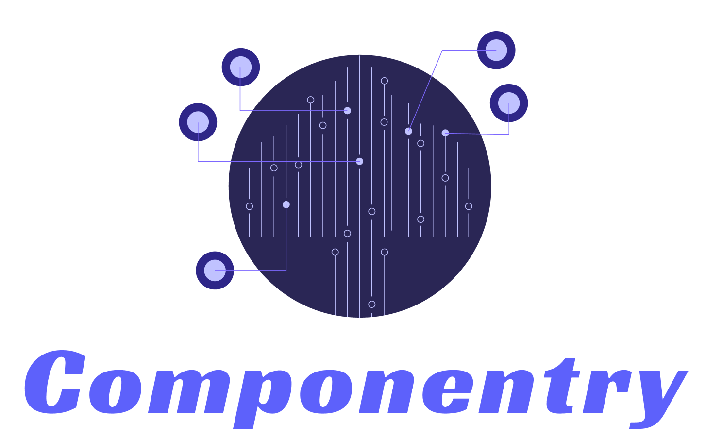

 

    

<h4 align="center">
  <em>A React component library for building highly performant, completely customizable design systems.</em>
</h4>

---

### Features

- Feather light 12kB footprint
- Zero runtime, 100% customizable component styles
- A++ accessibility built in to every component
- Designed for flexibility and component composition

### Documentation

Full documentation is available at
[componentry.design](https://componentry.design)

### Contributing

Componentry is an open source project that welcomes and appreciates
contributions from everyone 🙌.   Please read the
[Code of Conduct](./CODE_OF_CONDUCT.md) and
[Contributing](./.github/CONTRIBUTING.md) guidelines to get started.

Componentry is HECKA RAD
